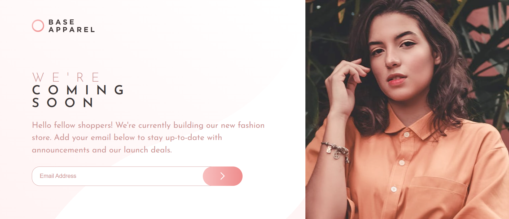

# Frontend Mentor - Base Apparel coming soon page solution

This is a solution to the [Base Apparel coming soon page challenge on Frontend Mentor](https://www.frontendmentor.io/challenges/base-apparel-coming-soon-page-5d46b47f8db8a7063f9331a0). Frontend Mentor challenges help you improve your coding skills by building realistic projects. 

## Table of contents

- [Overview](#overview)
  - [The challenge](#the-challenge)
  - [Screenshot](#screenshot)
  - [Links](#links)
- [My process](#my-process)
  - [Built with](#built-with)
  - [What I learned](#what-i-learned)
  - [Continued development](#continued-development)
  - [Useful resources](#useful-resources)
- [Author](#author)

## Overview

### The challenge

Users should be able to:

- View the optimal layout for the site depending on their device's screen size
- See hover states for all interactive elements
- Receive an error message when the form is submitted if:
  - The input field is empty
  - The email address is not formatted correctly

### Screenshot



### Links

- Solution URL: [GitHub Repo](https://github.com/JohnsonSaka123/base-apparel-coming-soon-master.git)
- Live Site URL: [Live Demo](https://johnsonsaka123.github.io/base-apparel-coming-soon-master/)

## My process
- Studied the Design Mockup
  - Carefully reviewed the desktop and mobile layout from the challenge brief to understand spacing, typography, and imagery.
- Set Up the Project Structure
Created the HTML and CSS files with a mobile-first approach. Basic folder structure included:

  - index.html

  - style.css

  - script.js

  - assets/ for images and icons


- Implemented the HTML Markup

  - Used semantic HTML to build the structure 
    
  - Added form input with a placeholder for the email field

- Styled the Layout with CSS

  - Mobile-first styling with media queries for desktop view

  - Flexbox was used for layout positioning

  - Styled the error message, button states, and form validation feedback

- Integrated the Background and Image Assets

  - Added responsive background image for mobile and desktop

  - Optimized image for different screen sizes

- JavaScript Form Validation

  - Validated email using regex on form submission

  - Displayed an error icon and message if the email was invalid or empty

  - Cleared input field and error messages after successful validation

### Built with

- Semantic HTML5
- CSS3 with custom properties
- Flexbox for layout
- Media queries for responsive design
- Vanilla JavaScript for form validation
- Mobile-first workflow

### What I learned

I gained hands-on experience in:

- Writing form validation logic with JavaScript
- Dynamically showing/hiding error icons and messages
- Resetting form input fields after successful submission without page reload
- Adapting a layout using media queries for mobile and desktop views

Here’s a snippet from my validation logic:

```js
form.addEventListener("submit", (e) => {
  e.preventDefault();
  const email = input.value.trim();
  if (email === "" || !email.match(validRegex)) {
    errorText.textContent = "Please provide a valid email";
    errorIcon.style.display = "block";
    input.classList.add("input-error");
  } else {
    errorText.textContent = "";
    errorIcon.style.display = "none";
    input.classList.remove("input-error");
    input.value = ""; // Clears the field
  }
});
```